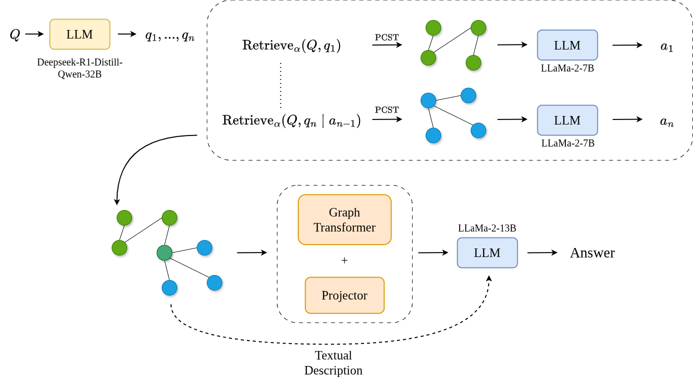

# DAGR: Decomposition Augmented Graph Retrieval with LLMs

This repository contains the source code used in the paper "**DAGR: Decomposition Augmented Graph Retrieval with LLMs**". 

Note that our contributions focus on the retrieval stage of the pipeline. The generation pipeline takes strong inspirations from "G-Retriever: Retrieval-Augmented Generation for Textual Graph Understanding and Question Answering" ; the original source code for their work, under the MIT license, can be found [here](https://github.com/XiaoxinHe/G-Retriever) and provides more information about certain parts of the code.




## Environment setup

Create an environement for the project:

```
conda create --name cool_name python=3.9 -y
conda activate cool_name

Following the versions used in G-Retriever:

Please check that your CUDA version is compatible with the following installations ; you can adapt the installations to your version, but mind that some libraries might work differently.

# https://pytorch.org/get-started/locally/
conda install pytorch==2.0.1 torchvision==0.15.2 torchaudio==2.0.2 pytorch-cuda=11.8 -c pytorch -c nvidia

python -c "import torch; print(torch.__version__)"
python -c "import torch; print(torch.version.cuda)"
pip install pyg_lib torch_scatter torch_sparse torch_cluster torch_spline_conv -f https://data.pyg.org/whl/torch-2.0.1+cu118.html

The other libraries needed (with their specified version) can be found in the requirements.txt file. The indicated versions are coherent with the previous setup. 

```

It is recommanded to follow the follwing strcuture for your files (the code assumes such a structure is respected):

```
.
└── home/project
    ├── code
    ├── datasets (downloaded from https://huggingface.co/rmanluo)
    ├── decomp_datasets (decomposing the questions)
    ├── preprocessed (encoded nodes, edges, graphs, questions...)
    ├── output (predictions, metrics...)
    └── requirements.txt
```
## Downloads

You can download the necessary datasets on HuggingFace and place them in the `datasets` folder : https://huggingface.co/datasets/rmanluo/RoG-cwq, https://huggingface.co/datasets/rmanluo/RoG-webqsp.

We choose to work with different LLaMa-2 models (7B and 13B). You can either download these models and use them locally, or you can also use them via online access with the transformers library for HuggingFace (https://huggingface.co/meta-llama/Llama-2-7b-hf).

That being said, you can also choose to use another LLM, but you will have to change the output dimensions of the linear projector within the pipeline. 


## Data Preprocessing
```

#generate the subquestions (processes the entire dataset by default, but could be changed to only handle the test-set)
python -m src.utils.subquestions --dataset webqsp
python -m src.utils.subquestions --dataset cwq


# webqsp
python -m src.dataset.preprocess.cwq_webqsp --dataset webqsp
python -m src.dataset.webqsp

# cwq
python -m src.dataset.preprocess.cwq_webqsp --dataset cwq
python -m src.dataset.cwq

```

## Training GNN + Projector

```
python train.py --dataset {cwq, webqsp} --model_name graph_llm --llm_model_name {7b, 13b} 

```

## Running Pipeline

Add your own path to the desired llm checkpoints in the `src/model/__init__.py`.

Then you can run the pipeline with : 

```
python -m pipeline --dataset {cwq, webqsp} --model_name graph_llm --llm_model_name {7b, 13b}
```
